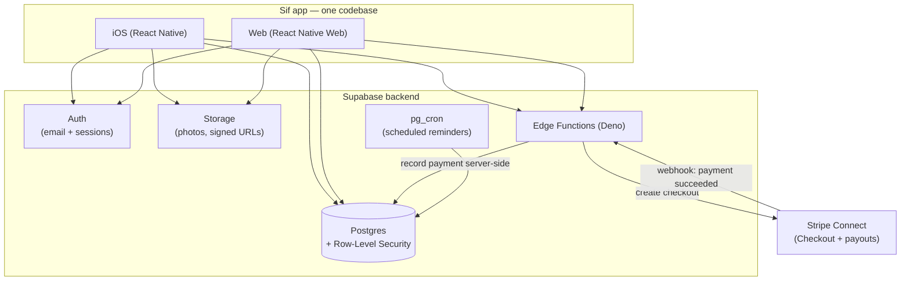

# Sif

**Your hair, remembered.** Sif is a haircut journal and stylist marketplace in one app — log every cut, track what you spent, remember exactly what to ask for next time, and book the stylist who nailed it. It runs natively on iPhone and in the browser from a single codebase.

<p>
  
  
  
  
  
  
</p>

> Dark-mode only, with a near-black background and a single orange accent — a calm, focused, "holographic" aesthetic inspired by Robinhood. The marketing landing page renders a glowing 3D model of the Norse goddess **Sif** (famed for her golden hair) in WebGL.

---

## Table of contents

- [What you can do](#what-you-can-do)
- [How it works (in plain terms)](#how-it-works-in-plain-terms)
- [Architecture](#architecture)
- [Tech stack](#tech-stack)
- [Project structure](#project-structure)
- [Getting started](#getting-started)
- [Configuration](#configuration)
- [Backend setup (Supabase)](#backend-setup-supabase)
- [Payments (Stripe Connect)](#payments-stripe-connect)
- [Notifications & reminders](#notifications--reminders)
- [Security model](#security-model)
- [Scripts](#scripts)
- [Roadmap](#roadmap)

---

## What you can do

### As someone who gets haircuts
- **Log every cut** with photos, price, tip, location, and the exact specs (lengths, techniques, tools, products).
- **See your spending** at a glance — totals, averages, tip %, and trends over time.
- **Never forget what worked** — each cut keeps the notes and settings so you can say "the same as last time" with confidence.
- **Get reminded** when you're due for your next cut, on a cadence you choose.
- **Find styles** that suit your hair type, length, and how much upkeep you want.

### As a stylist
- **A bookable profile** with your services, prices, hours, and reviews.
- **Smart scheduling** — define each service's duration and automatic buffer time so back-to-back bookings never collide.
- **Take payments online** — deposits to hold a slot and balances after the cut, paid in-app via Stripe, or marked paid for cash.
- **A business dashboard** — upcoming appointments, earnings, busiest times, and client retention, exportable to CSV.

### Social
- A **public feed** of shared cuts, with likes and comments.
- **Follow/connect** with people and stylists, and **direct messages** (with photo sharing).
- Public, shareable profiles at `goldensif.com/u/<username>`.

---

## How it works (in plain terms)

Think of Sif as three pieces that talk to each other:

1. **The app** — what you see and tap, on your phone or in a browser. One codebase builds both.
2. **The backend** — a secure database (Supabase) that stores accounts, cuts, bookings, and messages. Every request is checked against rules so people can only ever see or change their own data.
3. **Payments** — money is handled by Stripe. Sif never sees card numbers, and the *server* (never the app on your phone) decides how much is owed, so a price can't be tampered with.

The golden rule throughout: **the phone asks, the server decides.** Anything involving money, permissions, or other people's data is enforced on the backend, not trusted from the app.

---

## Architecture



**Key ideas**

- **Single codebase, two platforms.** Expo + Expo Router builds the native iOS app and the website from the same TypeScript. Platform differences are isolated in `.web.tsx` / `.ios.tsx` files (e.g. `landing.web.tsx` for the WebGL hologram).
- **The database enforces access, not the app.** Postgres [Row-Level Security](https://supabase.com/docs/guides/auth/row-level-security) policies gate every read and write, so a malicious client still can't reach data it shouldn't.
- **Money is server-authoritative.** Booking prices and deposits are computed by database triggers; payments are written *only* by the Stripe webhook (service role) or validated `SECURITY DEFINER` functions — never by the client directly.
- **Edge Functions** (Deno) handle the few things that need a trusted server: Stripe onboarding, creating Checkout sessions, the Stripe webhook, and sending web push.

---

## Tech stack

| Layer | Choice | Why |
|---|---|---|
| App framework | **Expo (SDK 54)** + **Expo Router** | One codebase for iOS + web, file-based routing, typed routes, React Compiler. |
| Language | **TypeScript** | End-to-end type safety, shared types between UI and data layer. |
| UI | **React Native** / **React Native Web** | Native feel on phones, real DOM on web. |
| State | **React Context** stores (`store/*`) | Lightweight, no extra dependency; one provider per domain. |
| Backend | **Supabase** (Postgres, Auth, Storage, Realtime, Edge Functions) | Managed Postgres with RLS, auth, file storage, and serverless functions in one place. |
| Payments | **Stripe Connect** | Marketplace model — pay the platform, route funds to stylists, optional platform fee. |
| 3D landing | **three.js** (WebGL + GLSL shaders) | Renders the glowing 3D Sif hologram on the marketing page. |
| Secure storage | **expo-secure-store** | Auth tokens live in the iOS Keychain / Android Keystore on device. |
| Scheduling | **pg_cron** | Fires appointment reminders on a schedule, in-database. |

---

## Project structure

```
app/                       Screens & navigation (Expo Router — each file is a route)
├─ (tabs)/                 Bottom tabs: index (Cuts), explore, discover, profile
├─ book/[id], pay/[id]     Booking + checkout flows
├─ messages/               Inbox, thread, new message, share
├─ dashboard, services,    Stylist tools
│  availability, bookings
├─ landing.web.tsx         WebGL 3D Sif hologram (marketing landing, web only)
└─ ...                     Auth, onboarding, settings, profiles, posts, insights

components/
├─ ui/                     Reusable primitives (Txt, Field, Screen, IconSymbol,
│                          UserSearchBox, UserResultRow, …)
├─ cuts/                   Haircut dashboard pieces (stats, timeline, cards)
└─ social/                 Stylist pickers, hours, reviews, relationship buttons

lib/                       Data access + domain logic (one module per feature)
├─ supabase.ts             Client + auth storage adapter (SecureStore / localStorage)
├─ bookings, payments,     Feature APIs over Supabase
│  reviews, messages, …
└─ payments/               Provider abstraction (mock ↔ Stripe)

store/                     React Context providers (auth, profile, haircuts, …)
hooks/                     Shared hooks (useUserSearch, useResponsive, useMoney, …)
constants/theme.ts         Design tokens (palette, spacing, radii, glow, type sizes)
types/index.ts             Shared TypeScript types
data/                      Static reference data (style catalog)
supabase/                  SQL migrations, Edge Functions, setup docs
scripts/                   Asset generators (app icons, image→ASCII)
```

---

## Getting started

**Prerequisites:** Node 18+ and npm. For the native app, the **Expo Go** app on your phone (or Xcode for a simulator).

```bash
npm install
npx expo start
```

Then:
- Press **`w`** to open the web version in your browser, or
- Scan the QR code with **Expo Go** on your iPhone (same Wi-Fi network).

Hit a stale-cache error ("requiring unknown module")? Restart with `npx expo start -c`.

The app ships with a working Supabase backend configured out of the box (see below), so it runs immediately after install.

---

## Configuration

- **Supabase connection** lives in `lib/supabase.ts`. The URL and **anon** key are safe to commit — the anon key is a public client key, and all access is gated by Row-Level Security. (Secrets like the *service role* key and Stripe keys are never in the client; they're stored as Edge Function secrets.)
- **Payments provider** is toggled in `constants/payments.ts`:
  - `'mock'` — a simulated in-app card flow for development (no real money).
  - `'stripe'` — live Stripe Connect (requires the setup below).
- Environment files (`.env`, `.env.*`) are git-ignored; only `.env.example` is tracked.

---

## Backend setup (Supabase)

> Only needed if you're standing up your **own** Supabase project. The committed config points at the existing hosted backend.

The schema is a series of idempotent SQL migrations in `supabase/`. **Each file is safe to re-run, and its header comment documents any prerequisites** (e.g. "Run this AFTER bookings.sql"). Paste them into the Supabase **SQL Editor** and run, in this order:

1. **Core:** `schema.sql` → `profiles.sql` → `public-profiles.sql`
2. **Social & content:** `social.sql`, `posts.sql`, `post-tags.sql`, `engagement.sql`, `engagement-replies.sql`, `notifications.sql`, `profile-links.sql`
3. **Haircuts & reminders:** `haircut-stylist.sql`, `cut-reminders.sql`
4. **Bookings:** `bookings.sql` → `booking-polish.sql` → `bookings-followups.sql` → `reminder-cadence.sql`
5. **Reviews & dashboard:** `reviews.sql`, `review-replies.sql`, `stylist-earnings.sql`, `dashboard.sql`
6. **Messaging:** `messages.sql` → `messages-depth.sql` → `messages-share.sql`
7. **Payments:** `payments.sql` → `stripe.sql`
8. **Push:** `push.sql`
9. **Security hardening (run last):** `security-hardening.sql` → `security-hardening-2.sql`

`test-accounts.sql` seeds demo logins for development only — **never run it in production** (it ships a shared password).

### Edge Functions

Deployed with the Supabase CLI (server-side bundling, no Docker needed):

```bash
supabase functions deploy push --use-api
supabase functions deploy stripe-connect --use-api
supabase functions deploy create-checkout-session --use-api
supabase functions deploy stripe-webhook --use-api --no-verify-jwt
```

`stripe-webhook` skips JWT verification because Stripe (not a logged-in user) calls it — it's authenticated by the Stripe signature instead.

---

## Payments (Stripe Connect)

Sif is a marketplace: clients pay the platform via **Stripe Checkout**, and funds route to the stylist's connected account via a **destination charge** with an optional platform fee. **Payments are recorded by a webhook, never client-side**, so the ledger always matches Stripe.

Full walkthrough — enabling Connect, setting secrets, registering the webhook, and going live — is in **[`supabase/STRIPE_SETUP.md`](supabase/STRIPE_SETUP.md)**.

Quick version:
1. Run `payments.sql` and `stripe.sql`.
2. `supabase secrets set STRIPE_SECRET_KEY=… STRIPE_WEBHOOK_SECRET=… APP_URL=https://goldensif.com PLATFORM_FEE_BPS=0`
3. Deploy the three Stripe functions and register the webhook for `checkout.session.completed` and `account.updated`.
4. Flip `PAYMENTS_PROVIDER = 'stripe'` in `constants/payments.ts`.

Test card: `4242 4242 4242 4242`, any future expiry, any CVC.

---

## Notifications & reminders

- **Appointment reminders** fire on a per-user cadence (default 24h before; configurable in Settings). A `pg_cron` job runs `process_booking_reminders()` every few minutes, and each `(booking, user, lead-time)` reminder fires exactly once. Rescheduling a booking resets its reminders automatically.
- **Haircut reminders** nudge you when you're due for your next cut based on your history.
- **Web push** is delivered via the `push` Edge Function; native push is on the roadmap.

---

## Security model

Sif went through a four-phase pre-launch hardening pass. Highlights:

- **Money & data integrity** — `payments` is not client-writable; the server computes amounts. Booking price/deposit/status are server-controlled via triggers, with role-scoped status transitions (only the stylist can confirm/complete; the client can only cancel/reschedule).
- **Privacy** — direct-message and haircut photos live in **private** storage buckets, served via short-lived **signed URLs** to conversation participants only. Messages can only be updated to set `read_at`.
- **Auth hardening** — auth tokens use **SecureStore** (Keychain/Keystore) on device; password-reset deep links are handled natively; Edge Functions validate redirect URLs against an allowlist.
- **Least privilege** — RLS on every table, tightened RPC grants, sanitized error responses, and a Stripe-onboarding gate that only applies to stylist accounts.

---

## Scripts

| Command | What it does |
|---|---|
| `npm start` / `npx expo start` | Start the Expo dev server (press `w` for web). |
| `npm run ios` | Open in the iOS simulator. |
| `npm run android` | Open on Android. |
| `npm run web` | Start the web build. |
| `npm run lint` | Lint with `expo lint`. |
| `node scripts/gen-icons.js` | Regenerate app icons/splash from `assets/brand/spear.svg`. |

Type-check with `npx tsc --noEmit`.

---

## Roadmap

- Native push notifications (currently web push only).
- Fully in-app payments via Stripe Payment Element / PaymentSheet (Checkout redirect today).
- Android release (iOS + web first).
- App Store launch (EAS build → TestFlight → release).

---

<sub>Built with Expo, Supabase, and Stripe. Dark-mode, orange-accented, and a little bit Viking.</sub>
